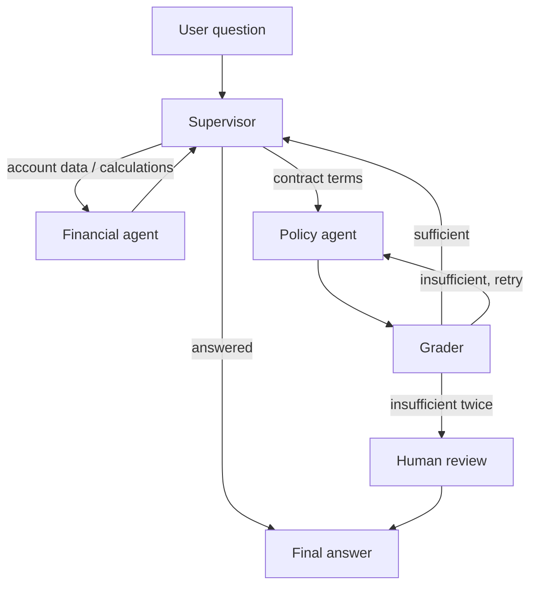

# Document Intelligence Agent

A multi-agent assistant for a loan servicing scenario. It answers two different
kinds of questions about a customer's mortgage — account figures pulled from a
database ("what's my balance", "what would my payment be if I overpaid €5,000")
and contract terms pulled from the customer's actual loan agreement ("can I
take a payment break", "is there a penalty for early repayment") — and routes
each to a specialist agent rather than handling both with one generic prompt.

The dataset is synthetic: five fictional customers and mortgages, with PDF
loan agreements generated to match. No real personal or financial data is
used anywhere in this repo.

## Architecture



- **Supervisor** — an LLM router that decides which specialist agent handles
  the question (or both, in sequence, for questions that need both), then
  synthesizes the final answer once enough information has been gathered.
- **Financial agent** — queries the loan database directly for account
  figures and calls dedicated calculation tools (monthly payment, overpayment
  impact, debt-to-income, early repayment charge). It's instructed never to
  do arithmetic itself — every number in its answer has to come from a tool
  call, not the model's own reasoning, so results are reproducible rather
  than an LLM's approximation of a formula.
- **Policy agent** — answers from the customer's actual contract, retrieved
  via a Chroma vectorstore filtered to that customer's `loan_id`. It's
  instructed to cite the specific clause it relied on.
- **Grader + retry + human review** — a policy answer that comes back
  uncertain gets one automatic retry with the question decomposed into more
  specific sub-queries. If that's still insufficient, the flow interrupts and
  waits for a human decision (approve or reject the proposed answer) before
  continuing — modeling a compliance-sensitive workflow rather than just
  returning a low-confidence answer.

All of the above tools — the SQL queries, the calculators, and the document
retrieval — live in a separate MCP (Model Context Protocol) server
(`src/Intelligent_agents/mcp_server/server.py`), not as plain functions bound
to the agents. The FastAPI app opens one persistent MCP session at startup
and reuses it for the app's entire lifetime, rather than opening a new one
per tool call — the first version of this did the latter, and every tool
invocation ended up spawning a fresh Python subprocess that reloaded the
embedding model from scratch, which is where most of the response latency
was actually coming from.

## Project structure

```
app.py                         FastAPI app: /query, /resume, /loans, /health
src/Intelligent_agents/
  graph/                       LangGraph wiring — build_graph()
  node/                        supervisor, grader, HITL, and agent nodes
  agents/                      builds the financial and policy agents,
                                owns the MCP client connection
  model/                       LLM instances and system prompts
  state/                       the shared graph state + structured-output schemas
  mcp_server/                  the MCP tool server (SQL, calculators, RAG retrieval)
  config.py                    resolves DB_PATH / CHROMA_PATH from the repo root
frontend/                      React + Vite UI
evals/                         a small labeled eval set + a runner that checks
                                pass/fail per question, grouped by category
notebook/                      one-off scripts used to generate the synthetic
                                loan database and ingest the PDF agreements
                                into the vectorstore (not part of the running app)
```

## Running locally

Requires Python 3.11+ and [uv](https://docs.astral.sh/uv/).

```bash
uv sync
cp .env.example .env   # then fill in OPENAI_API_KEY
uv run uvicorn app:app --reload --port 8000
```

```bash
cd frontend
npm install
npm run dev
```

The frontend expects the backend at `http://localhost:8000` (see `API` in
`frontend/src/App.jsx`) and the backend expects the frontend's origin in
`ALLOWED_ORIGINS` for CORS — see below.

### Docker Compose

```bash
docker compose up --build
```

Backend on `:8000`, frontend (built and served via nginx) on `:3000`.

## Environment variables

| Variable | Required | Notes |
|---|---|---|
| `OPENAI_API_KEY` | yes | all agents run on `gpt-4o-mini` |
| `ALLOWED_ORIGINS` | no | comma-separated CORS origins for the backend; defaults to `http://localhost:5173,http://localhost:3000` (Vite dev server + the Docker Compose frontend) |
| `HUGGINGFACEHUB_API_TOKEN` | no | only needed if re-running `notebook/ingest_docs.py` against a gated model; the embedding model used at runtime (`all-MiniLM-L6-v2`) is public |
| `LANGSMITH_API_KEY` / `LANGSMITH_PROJECT` / `LANGSMITH_TRACING` | no | optional tracing, off by default |

## Evals

`evals/eval_set.py` has a small set of labeled questions across categories —
plain policy lookups, a deliberately conflicting policy clause (a general
term overridden by a specific addendum), SQL/financial lookups, calculator
questions, and one designed to trigger the human-review escalation.

```bash
uv run python -m evals.eval_run
```

Each question is checked against an expected substring (or, for the
escalation case, that it actually triggered the review interrupt), with a
pass/fail summary printed by category at the end.

## Notes on a few deliberate choices

- **Conversation memory is in-memory (`InMemorySaver`), not persisted.**
  Every browser session gets a fresh `thread_id`, and switching between the
  demo customers in the UI starts a new one deliberately — there's no reason
  one customer's conversation should carry into another's, and no reason to
  persist a demo conversation across a server restart.
- **Rate limiting is per-IP, not per-account** (`slowapi`, 10 requests/hour
  on `/query` and `/resume`). There's no user auth here — the goal is
  keeping a public demo from being exhausted by one visitor's browser
  refresh or a stray bot hitting the endpoint in a loop, not access control.
- **`mcp` is pinned below v2** (`mcp<2` in `pyproject.toml`). The v2 release
  restructured the SDK's API — `mcp.server.fastmcp.FastMCP`, which the tool
  server is built on, doesn't exist there — so this is a deliberate pin, not
  an oversight.

## Known limitations

- The supervisor's router has no explicit "this isn't a loan question"
  branch — an off-topic message currently gets forced into one of the two
  specialist agents rather than getting a graceful redirect.
- Rate limiting is in-process; running multiple backend replicas behind a
  load balancer would need a shared store (e.g. Redis) instead, since each
  instance currently tracks its own counts independently.
